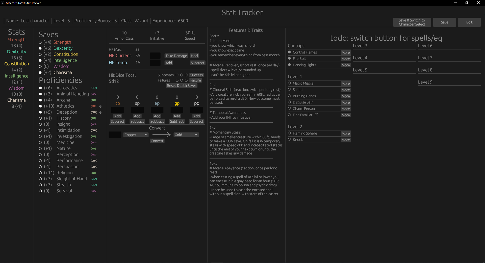

# A simple, local D&D stat tracker.

This was made for my own personal use, because i wanted to keep track of my dnd characters but all official apps required me to buy online resources which i either have physically or simply don't want to buy. This is why i created this.

It's' built to work in 1920x1080 resolution. On bigger it should work fine, on smaller some elements will overlap with each other or be outside of the screen.

TODO:
- [X] - character basic info (name, class, exp) + editable
- [X] - ability scores + editable
- [+/-] - saving throws and skill modifiers, proficiencies and expertise + editable
- [X] - hitpoints, AC, temporary hitpoints, hit dice etc. + editable
- [X] - money, including a converter
- [ ] - equipement as text
- [ ] - weapons and hit/dmg modifiers
- [X] - spell list + spell slots
- [ ] - more spells as json files
- [X] - local character saves
- [ ] - if im really into it, redesign most elements myself for the ui to not look stock

How it looks currently:

